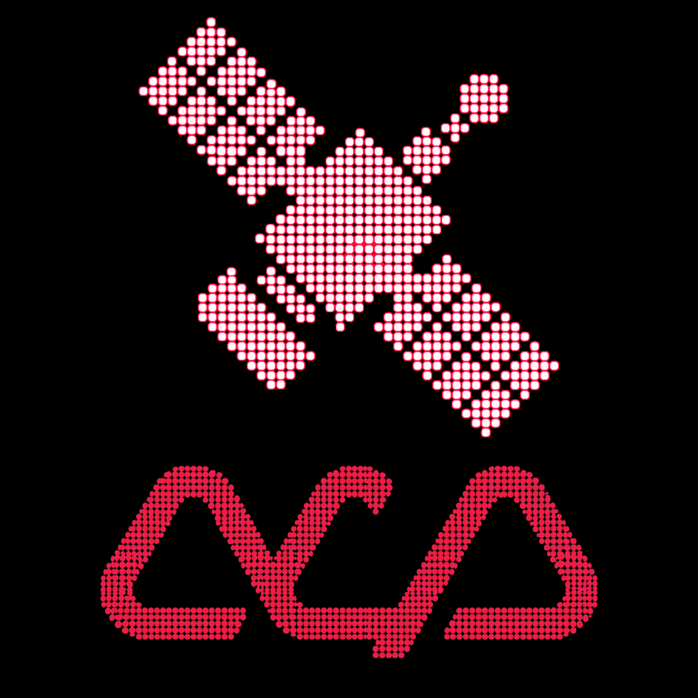

# a8 Orbital Command Centre

https://github.com/abliter8-ai/orbital-command-centre

Plans, ideas, and completion reports live in [`docs/`](docs/).  
Vendored protocol references used for study live beside this repo at `../vendored` (gitignored here).

**Control everything.**

<p align="center">
  
</p>

**Orbital Command Centre (OCC)** is a multi-protocol agent control plane and adaptor layer.  
It lets a primary coding agent (especially Claude Code) treat other coding agents — Codex, Cursor, Grok, Pi, OpenCode, and more — as first-class **sub-agents**, while also speaking **ACP** and **A2A**.

Claude (or any orchestrator) stays in the high-value planning & review seat.  
Expensive or specialised work is delegated. Tokens are saved. Models that would otherwise be unreachable become available.

---

## Why

Modern coding agents are powerful but isolated.  
You either stay inside one ecosystem or become a human clipboard.

OCC provides a unified control surface so that:

- Claude Code can `delegate_to_codex`, `delegate_to_cursor`, `delegate_to_grok`, `delegate_to_opencode`, etc.
- Editors and UIs can drive the same agents over **ACP**
- Agents can discover and talk to each other over **A2A**
- Everything shares one internal runtime model, one registry, and one permission story

---

## Core Idea

```
┌─────────────────────────────────────────────────────────────┐
│                    Orbital Control Plane                    │
│                                                             │
│   AgentHandle  (lifecycle · prompt · stream · cancel)       │
│                                                             │
│   ┌──────────┐   ┌──────────┐   ┌──────────────────────┐   │
│   │ MCP      │   │ ACP      │   │ A2A                   │   │
│   │ façade   │   │ transport│   │ transport             │   │
│   │ (tools)  │   │          │   │                       │   │
│   └──────────┘   └──────────┘   └──────────────────────┘   │
│          │              │                 │                 │
│          └──────────────┼─────────────────┘                 │
│                         ▼                                   │
│              Adapters (Codex · Cursor · Pi · OpenCode · …)  │
└─────────────────────────────────────────────────────────────┘
```

The internal contract is an **AgentHandle**.  
MCP, ACP and A2A are just different ways of talking to the same handles.

---

## Target Agents (initial)

| Agent        | Primary integration path          | Notes                          |
|--------------|-----------------------------------|--------------------------------|
| Codex        | ACP / CLI                         | Strong first target            |
| Cursor       | ACP / A2A / headless              | Also surfaces Grok models      |
| OpenCode     | Headless / A2A                    | Model-flexible                 |
| Pi           | a2a-adapter style                 | Lightweight                    |
| Grok         | Headless `grok -p` (OCC adapter)  | Native X / web / Imagine in brief |

More adapters can be added without changing the control plane.

---

## Status

**IP-001 + IP-002 + IP-003 landed.** Claude Code can call `occ_health`, `delegate_to_codex`, `delegate_to_cursor`, and `delegate_to_grok` over MCP stdio. ACP, A2A, and the control-plane daemon are not built yet.

---

## Claude Code loop

Requires Node ≥22, pnpm 10, and the local CLIs you want to delegate to (`codex`, `cursor-agent`, `grok`). Never use `agent` for Cursor — that name is Grok on PATHs that include `~/.grok/bin`. Override Grok with `GROK_BIN`.

```bash
pnpm install
pnpm build
pnpm test
```

Register the server (from this repo root, after `pnpm build`):

```bash
claude mcp add orbital -- node "$(pwd)/packages/mcp-facade/dist/stdio.js"
```

Or copy `.mcp.json` into the workspace you want Claude to drive. Then:

1. Call `occ_health`. Confirm the target CLI is `available` and `authenticated`.
2. Call `delegate_to_codex`, `delegate_to_cursor`, or `delegate_to_grok` with a **self-contained brief**: goal, constraints, files in play, definition of done. Pass `cwd` if the server was not launched in that repo. Use `sandbox: "read-only"` for investigation.
3. Review the structured result (status, summary, files changed, `sessionId`).
4. To continue the same thread, pass that `sessionId` as `resume_session_id`.

Codex default write path is `--approve-for-me` (0.148 refuses `--sandbox` together with that flag). Cursor write path is `cursor-agent -p --force --trust` with stream-json; read-only is `--mode ask`. Grok is `grok --no-leader -p --output-format json --verbatim`. Write path adds `--always-approve`. OS `--sandbox` is not passed (hangs grok 1.0.5 headless). OCC never passes `--dangerously-bypass-approvals-and-sandbox`. Spawned Cursor processes set `AGENT_CLI_CREDENTIAL_STORE=file` so a locked macOS login keychain does not fail the CLI. Override binaries with `CODEX_BIN` / `CURSOR_BIN` / `GROK_BIN`. Grok-native X / web / Imagine stay inside Grok — name them in the brief, do not expect OCC tools for them.

---

## Package layout (now)

```
packages/
  core/                 # AgentHandle, Task/Session model, types
  adapters/kit/         # shared spawn / cwd
  adapters/codex/       # codex exec
  adapters/cursor/      # cursor-agent -p
  adapters/grok/        # grok -p
  mcp-facade/           # occ_health, delegate_to_codex, delegate_to_cursor, delegate_to_grok
```

Still planned, not in this repo yet: `packages/acp`, `packages/a2a`, more adapters, `packages/control-plane`.

---

## Quick Mental Model for Users

1. Claude analyses the task and writes a precise brief.
2. It calls an OCC tool (`delegate_to_codex`, `delegate_to_cursor`, `delegate_to_grok`, …).
3. The external agent runs in its own context / sandbox / worktree.
4. Claude receives the result (or diff) and continues as the reviewer / integrator.

Same agents remain available to any ACP client or A2A peer.

---

## Development Roadmap (high level)

- [x] Project + branding
- [x] Core `AgentHandle` interface + task model
- [x] First working adapter (Codex via `codex exec`)
- [x] MCP façade (`delegate_to_codex`)
- [x] Second adapter (Cursor via `cursor-agent -p`) + in-memory registry
- [x] Third adapter (Grok via `grok -p`)
- [ ] A2A server surface on the same handles
- [ ] Full control-plane daemon (lifecycle, isolation, permissions)
- [ ] Polish, docs, and more adapters

---

## Vendored Foundations

This project builds on (and studies) excellent prior work including:

- Agent Client Protocol (ACP) + TypeScript SDK
- A2A (Agent2Agent) + a2a-js / a2a-adapter
- a2a-bridge
- cursor-agent-a2a
- Claude / Codex ACP adapters
- FastMCP
- cc-multi-cli-plugin patterns
- ACP Registry

---

## Licence

TBD (likely Apache-2.0 or MIT)

---
