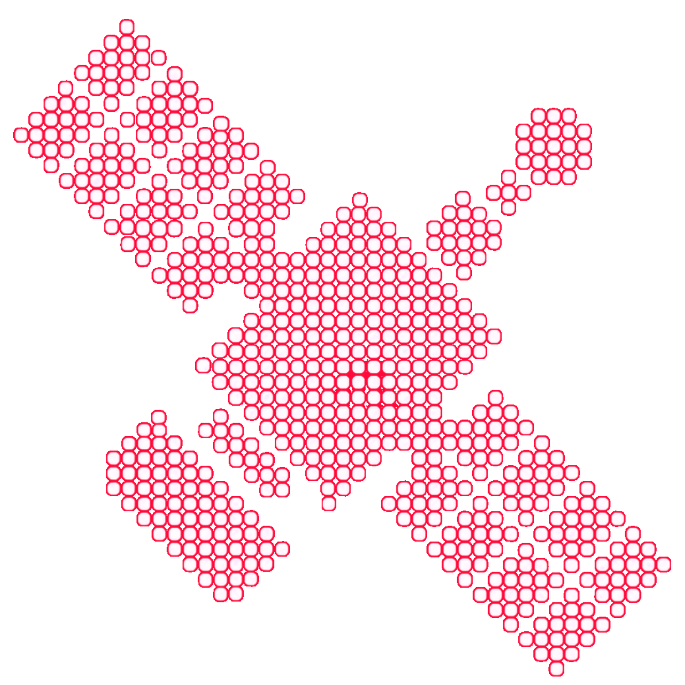
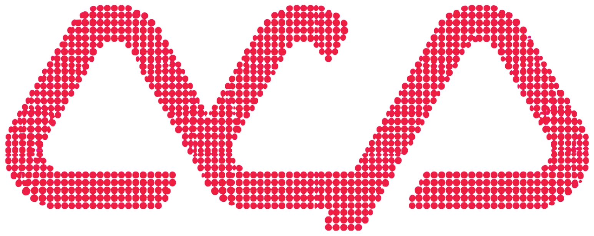

<p align="center">
  
</p>
<p align="center">
  
</p>

<p align="center"><strong>Control everything.</strong></p>

<p align="center">
  
  
  
  <a href="https://abliter8.ai"></a>
</p>

<p align="center">
  
</p>

**Orbital Command Centre (OCC)** is a multi-protocol agent control plane and adapter layer from [abliter8.ai](https://abliter8.ai).  
It lets a Claude agent orchestrate a **swarm** of other coding agents — Codex, Cursor, Grok, Antigravity, and more — as first-class **sub-agents**, while also speaking **ACP** and **A2A**.

Claude stays in the high-value planning &amp; review seat.  
Expensive or specialised work is delegated. Tokens are saved. Models that would otherwise be unreachable become available.

<p align="center">
  <br>
  <strong>Claude holds the plan. The swarm does the work.</strong>
</p>

<table align="center">
  <tr>
    <td align="center" width="130">
      <br>
      <strong>Codex</strong>
    </td>
    <td align="center" width="130">
      <br>
      <strong>Cursor</strong>
    </td>
    <td align="center" width="130">
      <br>
      <strong>Grok</strong>
    </td>
    <td align="center" width="130">
      <br>
      <strong>Antigravity</strong>
    </td>
  </tr>
</table>

<p align="center">
  
</p>

https://github.com/abliter8-ai/orbital-command-centre

---

## Why

Modern coding agents are powerful but isolated.  
You either stay inside one ecosystem or become a human clipboard.

OCC provides a unified control surface so that:

- Claude Code can `delegate_to_codex`, `delegate_to_cursor`, `delegate_to_grok`, `delegate_to_antigravity`, `delegate_to_opencode`, etc.
- Editors and UIs can drive the same agents over **ACP**
- Agents can discover and talk to each other over **A2A**
- Everything shares one internal runtime model, one registry, and one permission story

---

## Core Idea

```
┌─────────────────────────────────────────────────────────────┐
│                    Orbital Control Plane                    │
│                                                             │
│   AgentHandle  (lifecycle · prompt · stream · cancel)       │
│                                                             │
│   ┌──────────┐   ┌──────────┐   ┌──────────────────────┐   │
│   │ MCP      │   │ ACP      │   │ A2A                   │   │
│   │ façade   │   │ transport│   │ transport             │   │
│   │ (tools)  │   │          │   │                       │   │
│   └──────────┘   └──────────┘   └──────────────────────┘   │
│          │              │                 │                 │
│          └──────────────┼─────────────────┘                 │
│                         ▼                                   │
│              Adapters (Codex · Cursor · Pi · OpenCode · …)  │
└─────────────────────────────────────────────────────────────┘
```

The internal contract is an **AgentHandle**.  
MCP, ACP and A2A are just different ways of talking to the same handles.

---

## Target Agents (initial)

| Agent        | Primary integration path          | Notes                          |
|--------------|-----------------------------------|--------------------------------|
| Codex        | ACP / CLI                         | Strong first target            |
| Cursor       | ACP / A2A / headless              | Also surfaces Grok models      |
| OpenCode     | Headless / A2A                    | Model-flexible                 |
| Pi           | a2a-adapter style                 | Lightweight                    |
| Grok         | Headless `grok -p` (OCC adapter)  | Native X / web / Imagine in brief |
| Antigravity  | Headless `agy -p` (OCC adapter)   | Google agent CLI; not `gemini` |
| Claude       | Headless `claude -p` (OCC adapter) | The flip: non-Claude orchestrators borrow Claude |

More adapters can be added without changing the control plane.

---

## Status

**All three surfaces and the control plane are built and live-verified.** Claude Code can call `occ_health`, `occ_models`, `occ_tasks`, `occ_cancel`, `occ_capabilities`, `delegate_to_codex`, `delegate_to_cursor`, `delegate_to_grok`, `delegate_to_antigravity`, `delegate_to_claude`, and Grok's first-class native tools `grok_x_search`, `grok_imagine`, `grok_video` over MCP stdio. The same five handles are also served over **ACP** (stdio, for editors like Zed) and **A2A** (HTTP/JSON-RPC, per-agent cards), and the `orbital` daemon hosts all agents behind one loopback port with policy mediation and an audit log. Model catalogs are live-probed from the installed CLIs.

---

## Install

macOS / Linux:

```bash
scripts/install.sh
```

Windows (PowerShell):

```powershell
pwsh scripts/install.ps1
```

The installer checks Node ≥22 / pnpm 10, builds and tests, verifies the underlying coding CLIs against the tested minimum versions (`--upgrade-clis` also runs each CLI's own `update`), registers the `orbital` MCP server with Claude Code — and, when detected, with Cursor (`~/.cursor/mcp.json`) and Codex (`~/.codex/config.toml`) so those harnesses can orchestrate too (timestamped backups; `--no-mcp` / `-NoMcp` opts out) — grants the fifteen `mcp__orbital__*` tool permissions in `~/.claude/settings.json` (with a timestamped backup), links the `delegating-to-*` and `choosing-the-right-agent` skills into `~/.claude/skills`, appends a short delegation pointer to `~/.claude/CLAUDE.md` (idempotent, `--no-claude-md` / `-NoClaudeMd` opts out), and refreshes the model catalog.

Refresh the per-agent model lists any time with:

```bash
scripts/update-models.sh      # or: pwsh scripts/update-models.ps1
```

This writes `~/.occ/model-catalog.json` (override with `OCC_CATALOG_PATH`). The server also self-refreshes on startup when the catalog is older than 24h (`OCC_CATALOG_REFRESH=off` disables). Restart Claude Code to pick up fresh slugs.

Manual alternative: `pnpm install && pnpm build && pnpm test`, then `claude mcp add orbital -- node "$(pwd)/packages/mcp-facade/dist/stdio.js"`.

---

## Claude Code loop

Requires Node ≥22, pnpm 10, and the local CLIs you want to delegate to (`codex`, `cursor-agent`, `grok`, `agy`). Never use `agent` for Cursor — that name is Grok on PATHs that include `~/.grok/bin`. Override Grok with `GROK_BIN`.

Then:

1. Call `occ_health`. Confirm the target CLI is `available` and `authenticated`. Call `occ_models` to pick a model from the live catalog, and `occ_capabilities` to see which agent owns a native capability (live X, media gen, grounded search, browser).
2. Call `delegate_to_codex`, `delegate_to_cursor`, `delegate_to_grok`, `delegate_to_antigravity`, or `delegate_to_claude` with a **self-contained brief**: goal, constraints, files in play, definition of done. Pass `cwd` if the server was not launched in that repo. Use `sandbox: "read-only"` for investigation. `delegate_to_codex` also takes `images` (absolute paths — Codex reads them with the prompt). Prefer the first-class tools for native capabilities: `codex_review` (structured review of uncommitted changes, a base branch, a commit, or a custom prompt), `antigravity_research` (grounded web research via `google_search` + `read_url`, with a permission pre-flight — `preflight: "fix"` merges `read_url(*)` into the agy settings, backing up first), `grok_x_search` (live X index — never a read-only delegate, it can hang on tool approval), `grok_imagine` (stills), `grok_video` (animate a still; no text-to-video).
3. Review the structured result (status, summary, files changed, `sessionId`; `mediaPaths` + `mediaSaved` on the media tools).
4. To continue the same thread, pass that `sessionId` as `resume_session_id`.
5. To stop a runaway delegation: `occ_tasks` with `status: ["running"]`, then `occ_cancel` with the `taskId`. Cancellation SIGTERMs the agent's whole process group (grandchildren included), escalating to SIGKILL after a 4s grace.

Codex default write path is `--approve-for-me` (0.148 refuses `--sandbox` together with that flag). Cursor write path is `cursor-agent -p --force --trust` with stream-json; read-only is `--mode ask`. Grok is `grok --no-leader -p --output-format json --verbatim`. Write path adds `--always-approve`. OS `--sandbox` is not passed (hangs grok 1.0.5 headless). OCC never passes `--dangerously-bypass-approvals-and-sandbox`. Spawned Cursor processes set `AGENT_CLI_CREDENTIAL_STORE=file` so a locked macOS login keychain does not fail the CLI. Claude is `claude -p --output-format stream-json` with OCC sandboxes mapped to `--permission-mode` (`plan` / `acceptEdits` / `bypassPermissions`); the child runs with `--strict-mcp-config` and an empty MCP config so it never inherits the orchestrator's MCP servers (no nested orbital fan-out), and the CLI's per-run cost meter is reported in the result summary (API-equivalent usage proxy on subscription auth; literal on API-key auth). Override binaries with `CODEX_BIN` / `CURSOR_BIN` / `GROK_BIN` / `AGY_BIN` / `CLAUDE_BIN`. Grok's X search and Imagine are first-class OCC tools, as are Codex review/image input and Antigravity web research; the remaining native surface (Grok thread fetch and open-web search, Antigravity's browser) stays inside the agent — name it in the brief (`occ_capabilities` lists the whole map). Known limit: on Zero Data Retention Grok accounts, video generation is refused server-side (`output.upload_url` required, not exposed by the CLI) — `grok_video` returns `mediaSaved: false` with the reason in `output`.

---

## Orchestrate from Cursor or Codex (the flip)

The MCP facade is harness-agnostic — anything that speaks MCP stdio can be the orchestrator, and with the Claude adapter that includes delegating *to* Claude *from* another agent. The installer registers orbital with Cursor and Codex automatically when it detects them; by hand, the config is:

```jsonc
// ~/.cursor/mcp.json
{
  "mcpServers": {
    "orbital": {
      "command": "node",
      "args": ["/path/to/a8-orbital-command-centre/packages/mcp-facade/dist/stdio.js"]
    }
  }
}
```

```toml
# ~/.codex/config.toml
[mcp_servers.orbital]
command = "node"
args = ["/path/to/a8-orbital-command-centre/packages/mcp-facade/dist/stdio.js"]
```

Cursor then sees `delegate_to_claude` (plus the other four delegates and the native tools) on its toolbelt; Codex likewise. A non-MCP peer can reach the same handles over A2A via the daemon (`http://127.0.0.1:7100/agents/claude`). Delegated Claude children run isolated from the orchestrator's MCP servers, so there is no recursive fan-out.

---

## ACP surface (editors)

`occ-acp` speaks ACP over stdio — one process per agent, the way Zed expects:

```jsonc
// ~/.config/zed/settings.json
{
  "agent_servers": {
    "OCC Grok": {
      "command": "node",
      "args": ["/path/to/a8-orbital-command-centre/packages/acp/dist/stdio.js", "--agent", "grok"]
    }
  }
}
```

`initialize` / `session/new` / `session/prompt` / `session/cancel` are implemented; ACP session modes map onto OCC sandboxes (`read-only`, `workspace-write`, `danger-full-access` — default `workspace-write`). Per-session model override via `_meta.model` on `session/new`, or `OCC_ACP_MODEL`. Streaming handles (Codex, Cursor, Claude) report live progress: tool calls appear as `tool_call` updates as they run and assistant text lands as `agent_message_chunk`s the moment the CLI emits it; buffered handles (Grok, Antigravity) deliver one chunk at turn end. `stopReason` maps `succeeded → end_turn`, `cancelled → cancelled`, `failed → refusal`.

## A2A surface (agents)

`occ-a2a --agent grok --port 7003` serves one agent over HTTP/JSON-RPC (v1.0 methods: `SendMessage`, `SendStreamingMessage`, `GetTask`, `ListTasks`, `CancelTask`, `SubscribeToTask`). The agent card lives at `/.well-known/agent-card.json` and advertises `streaming: true`; skills are generated from the same capability profile `occ_capabilities` serves. Brief goes in text parts; `cwd` / `sandbox` / `model` / `effort` ride in **message** metadata (`params.message.metadata`, not `params.metadata`). `SendStreamingMessage` answers with SSE: streaming handles (Codex, Cursor, Claude) publish text as appended `artifactUpdate` chunks and tool activity as working-status updates while the run is live; buffered handles deliver their artifact at the end. `CancelTask` kills the underlying process group.

**Long tasks and re-attachment.** Tasks are server-side state: once a run starts it survives its client. A blocking `SendMessage` client that disconnects mid-run does not lose the work — the task runs to completion and the result is retrievable. Two patterns, in order of robustness:

1. **Prefer `SendStreamingMessage` for anything that might run long.** The first SSE frame carries the full task object, so you learn the `taskId` at t=0. If the stream drops, resume with `SubscribeToTask` (live frames) or poll `GetTask`.
2. **Blocking `SendMessage`:** if the connection dies before the response, rediscover the task with `ListTasks` (sorted by recency; filter by `contextId`/`status`, pass `includeArtifacts: true` for results) and fetch it with `GetTask`.

Two `@a2a-js/sdk` wire quirks are normalized server-side so spec-conformant clients behave: `ListTasks` without a `status` filter would never match anything (the SDK decodes an absent filter as `TASK_STATE_UNSPECIFIED` and then filters on it), and message roles sent as `"user"`/`"agent"` would land in history as `UNRECOGNIZED` (the SDK expects `ROLE_USER`/`ROLE_AGENT`). Both are fixed at the transport boundary.

**Crash-proof tasks.** Both `occ-a2a` and the daemon persist tasks to per-agent JSON snapshot files (`~/.occ/a2a-tasks/<agent>.json`, `daemon-<agent>.json` for the daemon; override the directory with `OCC_A2A_TASKS_DIR`). Every state change is written atomically (tmp + rename) before the event is visible, so a `kill -9` loses nothing committed and a restart rehydrates `GetTask`/`ListTasks` fully — verified by hard-killing a server mid-run and recovering the completed result after relaunch. An unreadable file is quarantined to `<file>.corrupt-<ts>` rather than crashing the server; terminal tasks older than 7 days are pruned at boot (in-flight tasks are never pruned). JSON rather than SQLite by design: delegation volume is a few writes per task, and a plain file stays dependency-free and inspectable. One writer per file — don't point two live servers at the same agent file.

## Control plane (`orbital`)

```bash
node packages/control-plane/dist/cli.js up       # detached daemon on 127.0.0.1:7100
node packages/control-plane/dist/cli.js status   # health + per-agent availability
node packages/control-plane/dist/cli.js audit    # JSONL delegation trail
node packages/control-plane/dist/cli.js down
```

The daemon hosts all five agents' A2A endpoints under one port (`/agents/<id>` + per-agent cards), and adds what the raw transports don't:

- **Registry** — `GET /v1/registry`: live availability, catalog models, and the capability map per agent.
- **Policy** — `~/.occ/orbital.json` per agent: `enabled`, `maxSandbox` (default caps everything at `workspace-write`; `danger-full-access` needs explicit opt-in), `defaultModel`, `isolation`. Over-cap or disabled-agent requests are rejected before any process spawns.
- **Worktree isolation** — `isolation: "worktree"` runs every delegation for that agent in a fresh `git worktree` detached at HEAD (under `~/.occ/worktrees`), removed when the task ends. The caller's working tree is never touched; uncommitted changes are invisible to the agent by construction. Stale worktrees from a crashed daemon are swept at startup. Requires the delegation `cwd` to be a git repo (non-repo cwd fails fast with `invalid_cwd`).
- **Audit** — every mediated delegation appended to `~/.occ/audit.jsonl` (agent, sandbox, model, status, duration), plus worktree lifecycle events, readable at `GET /v1/audit` or `orbital audit`.

Multi-tenant hosting note: one daemon port serves all agents under `/agents/<id>/` prefixes rather than one port per agent; cards are rewritten from the request `Host` so they stay correct behind proxies.

## Package layout (now)

```
packages/
  core/                 # AgentHandle, Task/Session model, capabilities + catalog data
  adapters/kit/         # shared spawn / cwd / process-tree kill
  adapters/codex/       # codex exec
  adapters/cursor/      # cursor-agent -p
  adapters/grok/        # grok -p
  adapters/antigravity/ # agy -p
  adapters/claude/      # claude -p
  mcp-facade/           # occ_* tools, delegate_to_*, grok_x_search / grok_imagine / grok_video
  acp/                  # ACP server over stdio (occ-acp --agent <id>)
  a2a/                  # A2A server over HTTP/JSON-RPC (occ-a2a --agent <id> --port N)
  control-plane/        # orbital daemon: registry, policy, audit, lifecycle (orbital up/down)
scripts/
  install.sh            # macOS/Linux installer (deps, build, MCP, permissions, skills, catalog)
  install.ps1           # Windows installer (same steps)
  update-models.sh      # refresh ~/.occ/model-catalog.json from the live CLIs
  update-models.ps1     # Windows twin
```

Still planned: more adapters.

---

## Quick Mental Model for Users

1. Claude analyses the task and writes a precise brief.
2. It calls an OCC tool (`delegate_to_codex`, `delegate_to_cursor`, `delegate_to_grok`, `delegate_to_antigravity`, …).
3. The external agent runs in its own context / sandbox / worktree.
4. Claude receives the result (or diff) and continues as the reviewer / integrator.

Same agents remain available to any ACP client or A2A peer.

---

## Development Roadmap (high level)

- [x] Project + branding
- [x] Core `AgentHandle` interface + task model
- [x] First working adapter (Codex via `codex exec`)
- [x] MCP façade (`delegate_to_codex`)
- [x] Second adapter (Cursor via `cursor-agent -p`) + in-memory registry
- [x] Third adapter (Grok via `grok -p`)
- [x] Fourth adapter (Antigravity via `agy -p`)
- [x] Live model catalog (`occ_models` + auto-refresh) and `occ_tasks` / `occ_cancel`
- [x] Process-tree kill on timeout/cancel; install + update-models scripts
- [x] Native-tool surfacing: `occ_capabilities` + first-class `grok_x_search` / `grok_imagine` / `grok_video`
- [x] First-class `codex review` and Codex image input; Antigravity research tool with permission pre-flight
- [x] ACP server surface on the same handles (`occ-acp`, stdio, session modes → sandboxes)
- [x] A2A server surface on the same handles (`occ-a2a`, HTTP/JSON-RPC, per-agent cards)
- [x] Control-plane daemon (`orbital`: registry, policy mediation, audit log, lifecycle)
- [x] Worktree isolation per delegation in the control plane
- [x] Streaming handles (ACP chunks / A2A SSE) once an adapter produces incremental output
- [x] Polish + docs
- [x] Fifth adapter (Claude via `claude -p`) — the flip: Cursor/Codex/Grok can orchestrate Claude
- [ ] More adapters (standing track — next candidate when a sixth CLI is installed)

---

## Vendored Foundations

Study copies of the protocol repositories live beside this repo at `../vendored` (gitignored — never a runtime dependency).

This project builds on (and studies) excellent prior work including:

- Agent Client Protocol (ACP) + TypeScript SDK
- A2A (Agent2Agent) + a2a-js / a2a-adapter
- a2a-bridge
- cursor-agent-a2a
- Claude / Codex ACP adapters
- FastMCP
- cc-multi-cli-plugin patterns
- ACP Registry

---

## Licence

TBD (likely Apache-2.0 or MIT)

---
